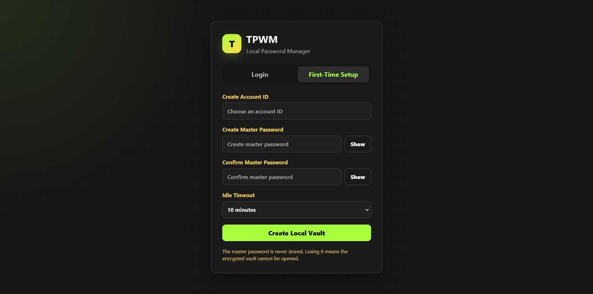
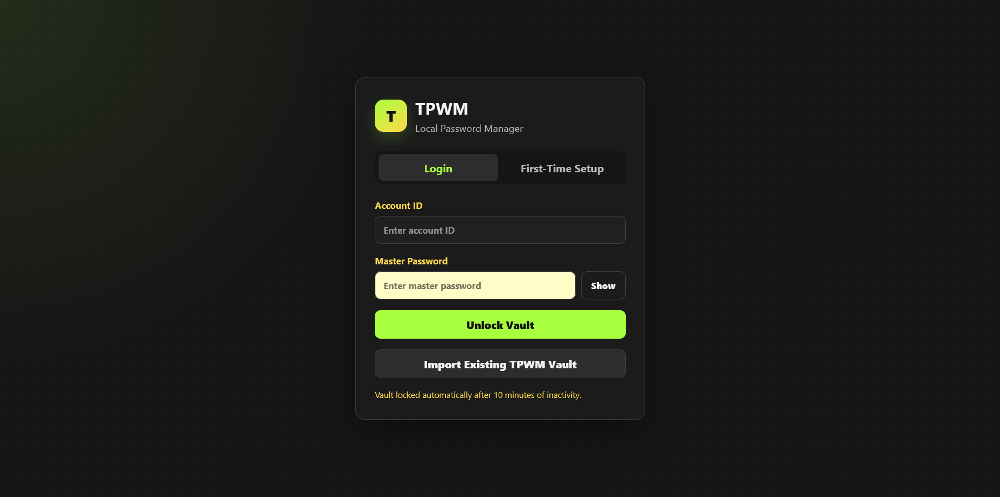
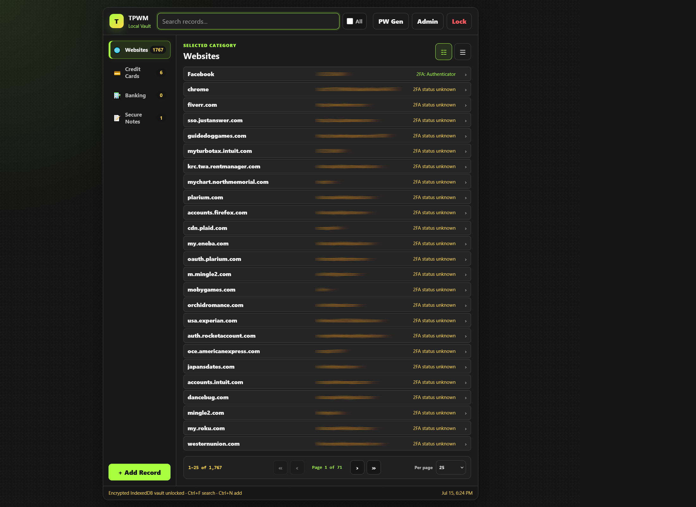
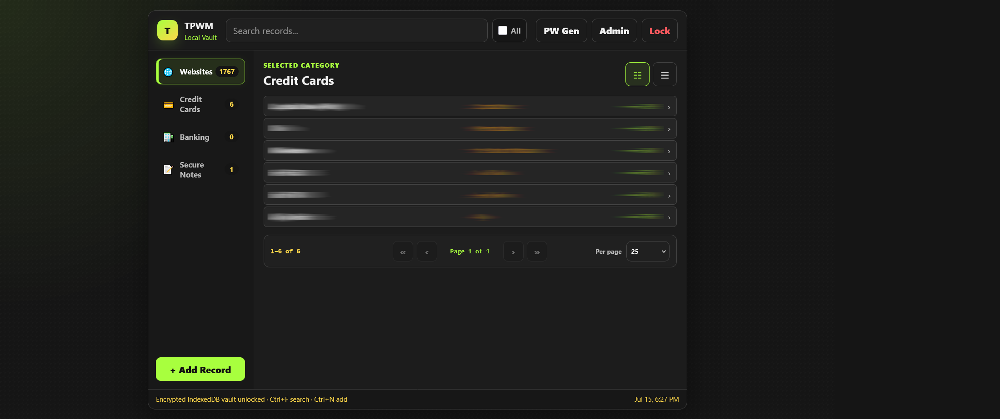
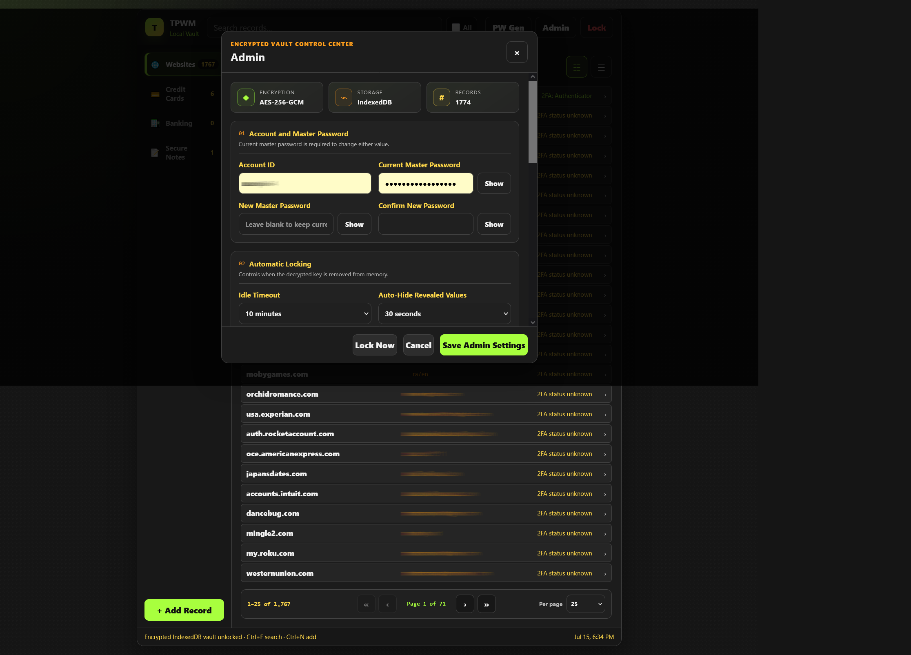

# 🔐 TPWM Standalone

## Overview

TPWM Standalone is a fully local encrypted password manager that runs directly in your web browser.

Unlike cloud password managers, TPWM stores your encrypted vault entirely on your own computer.

**No accounts.  
No subscriptions.  
No cloud storage.  
No telemetry.  
No advertisements.**

---

## Features

- 🔐 AES-GCM encrypted password vault
- 🔑 PBKDF2 master password protection
- 🌐 Website account management
- 💳 Credit card manager
- 🏦 Banking information manager
- 📝 Secure notes
- 🔍 Fast search
- 🎲 Password generator
- 📥 Import existing databases
- 📤 Export encrypted backups
- 💯 Completely offline operation

---

## Screenshots

### First Time Setup

### Login

### Website Manager

### Credit Cards

### Administration

---

## Getting Started

1. Download the latest release.
2. Extract the ZIP file.
3. Double-click **index.html**.
4. Create your master password.
5. Start adding your accounts.

No installation required.

---

## Privacy

TPWM was built around one principle:

**Your passwords belong to you.**

TPWM never sends your data anywhere.

Everything remains on your own computer.

---

## Firefox Extension

A Firefox Click-to-Fill companion extension is being developed separately.

Repository:

**TPWM**

---

## License

MIT License
